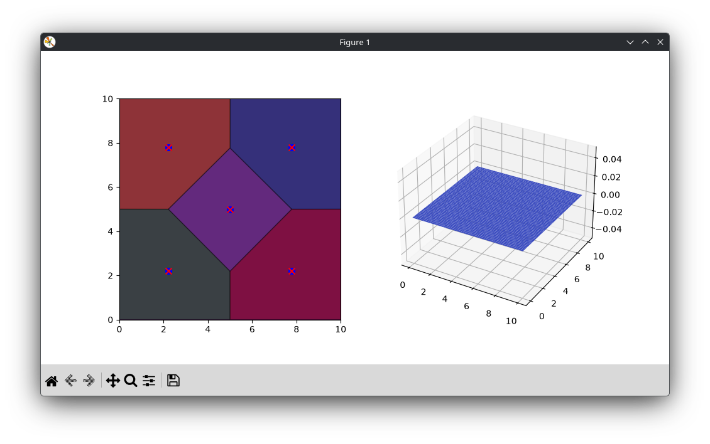

# quanser-swarm-control

## Quickstart
This setup assumes that `uv` is installed on the system. You can still do the same things without `uv`, though.

This setup applies for the `main_wo_quanser.py`. This won't work for the other `main*.py` files.
```
$ git clone https://github.com/michabay05/quanser-swarm-control
$ cd quanser-swarm-control
$ uv venv
$ uv pip install -r requirements.txt
$ python main_wo_quanser.py
```

After running it for a few seconds, it should look this.

